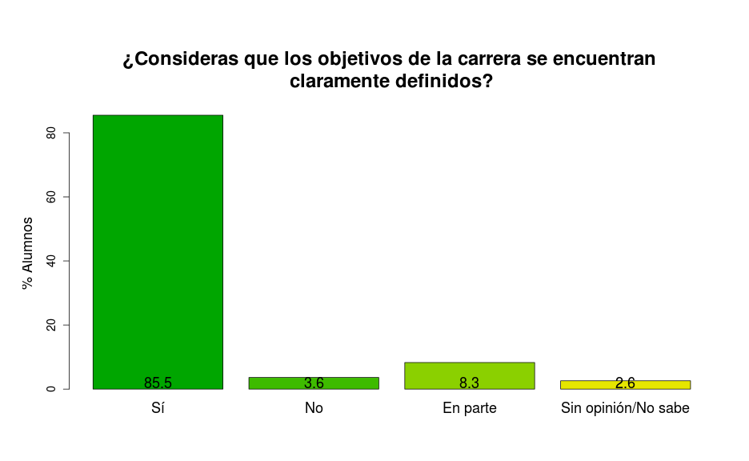
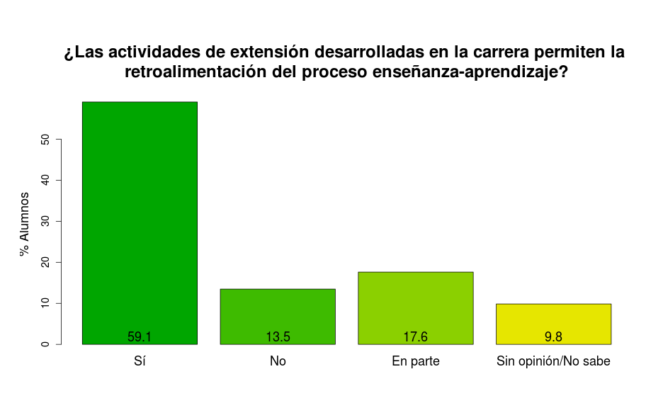
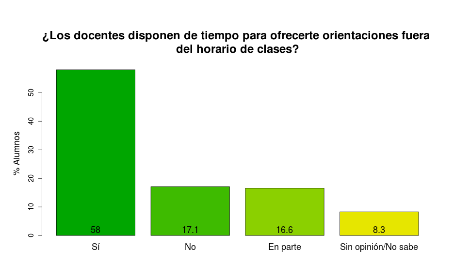

# Alumnos - Odontología 2014
## Descripción
Aquí presentamos los resultados de las encuestas de `evaluación institucional` llevada a cabo en julio del 2014 en la que se recabaron datos de los `alumnos de la Carrera de Odontología` de la Facultad de Ciencias de la Salud (Sede Asunción) de la Universidad del Norte. La encuesta consistió en un formulario de `91 preguntas` evaluando cada una de las siguientes dimensiones:

* __Dimensión 1: Organización & Gestión__
    * 1.1: Organización
    * 1.2: Gestión
* __Dimensión 2: Proyecto Académico__
    * 2.1: Objetivos de carrerra y Perfil de Egreso
    * 2.2: Plan de estudios
    * 2.3: Proceso enseñanza-aprendizaje
    * 2.4: Evaluación del proceso enseñanza-aprendizaje
    * 2.5: Investigación y extensión
* __Dimensión 3: Personas__
    * 3.1: Directivos
    * 3.2: Docentes
    * 3.3: Estudiantes
    * 3.4: Personal administrativo y de apoyo
* __Dimensión 4: Recursos__
    * 4.1: Infraestructura, equipamientos e insumos

El formulario de encuesta también incluyó preguntas acerca del `Curso` (1er., 2do., 3er y 4to y 5to cursos). Se obtuvieron `193` formularios de respuestas, los cuales fueron cargados en una base de datos en formato `.csv` para su análisis estadístico. Los datos fueron preprocesados y analizados con [R](http://www.r-project.org) versión 3.1.0. Este documento fue redactado utilizando MarkDown en [RStudio](http://www.rstudio.com) versión 0.98.501 y el paquete [knitr](http://cran.r-project.org/web/packages/knitr/index.html) versión 1.6 de [Yihui Xie](http://yihui.name/knitr).


```r
# Establecemos las opciones globales
require(knitr)
opts_chunk$set(echo = FALSE, warning = FALSE, message = FALSE, fig.height = 8, fig.width = 13)
```


***

## Resultados
### Distribución por Cursos
 

***

### Dimensión 1.1 - Organización
        

***

### Dimensión 1.2 - Gestión
         

***

### Dimensión 2.1 - Objetivos de la carrera y Perfil de Egreso
     

***

### Dimensión 2.2 - Plan de Estudios
      

***

### Dimensión 2.3 - Proceso enseñanza-aprendizaje
         

***

### Dimensión 2.4 - Evaluación del proceso enseñanza-aprendizaje
   

***

### Dimensión 2.5 - Investigación & extensión
          

***

### Dimensión 3.1 - Directivos
    

***

### Dimensión 3.2 - Docentes
   

***

### Dimensión 3.3 - Estudiantes
      

***

### Dimensión 3.4 - Personal administrativo y de apoyo
    

***

### Dimensión 4.1 - Infraestructura, equipamientos e insumos
                       

***
